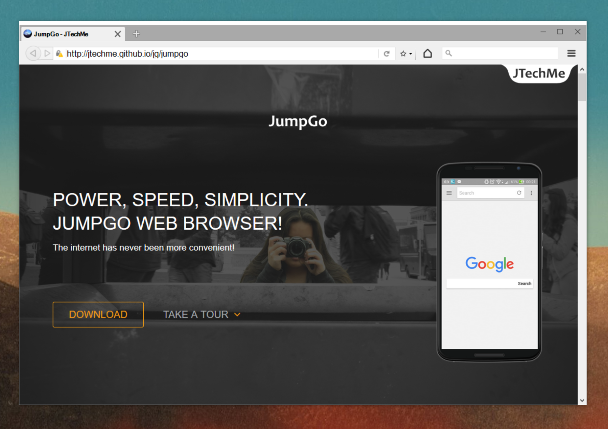

# JumpGo for Windows   
JumpGo for Windows is curently divided into two projects: JumpGo Standard and JumpGo Dev. JGUpdater, JGUpdaterElevated, JGSetupTBU and JGSetupDE are projects also included in this repo. For development instructions please the [the wiki](https://github.com/JTechMe/JumpGo-for-Windows/wiki) and any documents it references.

## JumpGo Standard Edition 

#

JumpGo for Windows Standard Edition is not a watered down version of JumpGo, but rather designed for use by the everyday user.

### Available Features

* GeckoFX Rendering Engine (v33.0.9.0)
* XULRunner (v33)
* [MDI Browser Tab Control](https://github.com/nutellarlz/MDI-Browser-Tab-Control)
* Windows 10 Support Layer (Win10SL v1.1) 
 * New PacificTen theme (only applied to JumpGo on Win10) 
  * Improved contrast
  * Custom controlbox
  * Updated title bar
  * Updated JGUI Dark Icons
  * New Start Menu Tiles
* New Pacific Theme (applied to JumpGo on Win7, Win8 and Win8.1) 
 * Improved contrast
 * Updated JGUI Dark Icons
* Updated Browser Menu
* Updated navigation buttons with responsive UI improvements

### Half-Developed Features

* JGUpdater
* History
* Bookmarks
* Incognito Mode
* Offline Mode
 * Offline Page

### Needed Features

* File Downloader
 * Download Handler
 * Download Manager
* "Open In New Tab" option
* Ability to open as default browser

## JumpGo Dev Edition 
